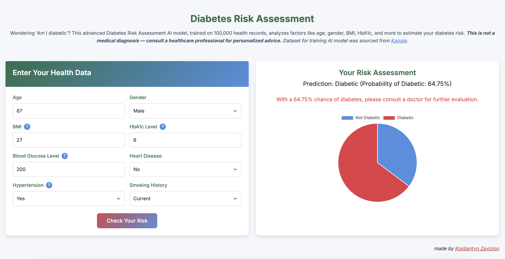

# Diabetes Predictor Web App

# 🧠 Diabetes Predictor Web App

> A simple and fast machine learning web app to predict diabetes based on patient health data.


---

## 🚀 Overview

This project is a lightweight, interactive **machine learning web app** that predicts the likelihood of diabetes based on user input. It leverages a **pre-trained Balanced Random Forest model**, a **FastAPI** backend, and a **HTML/Jinja2 frontend**.

---

## 📸 Preview



---

## ✨ Features

- 🧪 Model training using `BalancedRandomForestClassifier` with GridSearch
- 📊 Input form: age, BMI, glucose, hypertension, etc.
- 📦 Pre-trained model loaded via `joblib`
- ⚡ FastAPI backend with async support
- 🎨 Simple, clean HTML frontend with Jinja2 templating
- 🧠 Optional retraining using Jupyter Notebook
- 🚀 Ready for local use or cloud deployment (AWS, Render, etc.)

---

## 🛠️ Tech Stack

- **Backend:** FastAPI
- **ML:** Scikit-learn, imbalanced-learn, joblib
- **Frontend:** HTML5, CSS, JS, Jinja2
- **Language:** Python 3.10+
- **Training Notebook:** Jupyter

---

## 📦 Project Structure

```plaintext
diabetes-predictor-app/
│
├── app/
│   ├── main.py                # FastAPI entry point
│   ├── templates/             # HTML templates
│   └── static/                # CSS or JS (optional)
│
├── model/
│   └── diabetes_model.pkl     # Trained ML model
│
├── notebooks/
│   └── train_model.ipynb      # Training and evaluation notebook
│
├── requirements.txt
├── README.md
└── .gitignore


## Usage

1. Clone the repository:
   ```bash
   git clone https://github.com/Kostiantin/diabetes-predictor-app.git
   cd diabetes-predictor-app
   ```

2. Create a virtual environment and install dependencies:
   ```bash
   python -m venv venv
   source venv/bin/activate  # or `venv\Scripts\activate` on Windows
   pip install -r requirements.txt
   ```

3. Run the app:
   ```bash
   uvicorn app.main:app --reload
   ```

4. Open your browser and go to:
   ```
   http://127.0.0.1:8000
   ```

## Train Your Own Model
Use the notebook in the `notebooks/` directory to load your data and train a new model. Save it with `joblib` or `pickle` to the `model/` folder.

---

## Author
Kostiantyn Zavizion (Your contact info or portfolio link here)